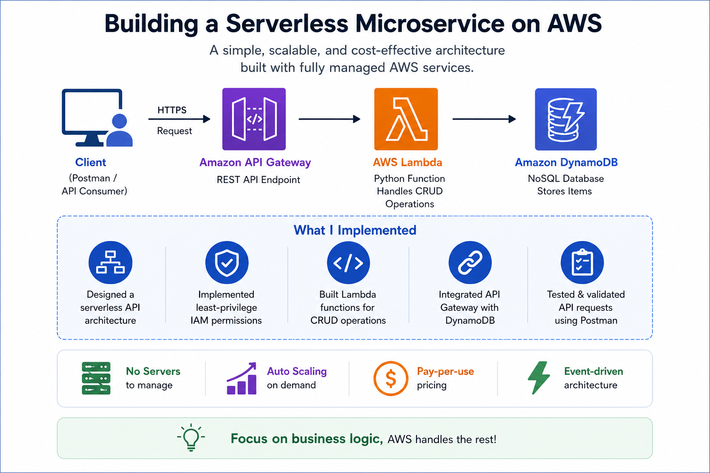
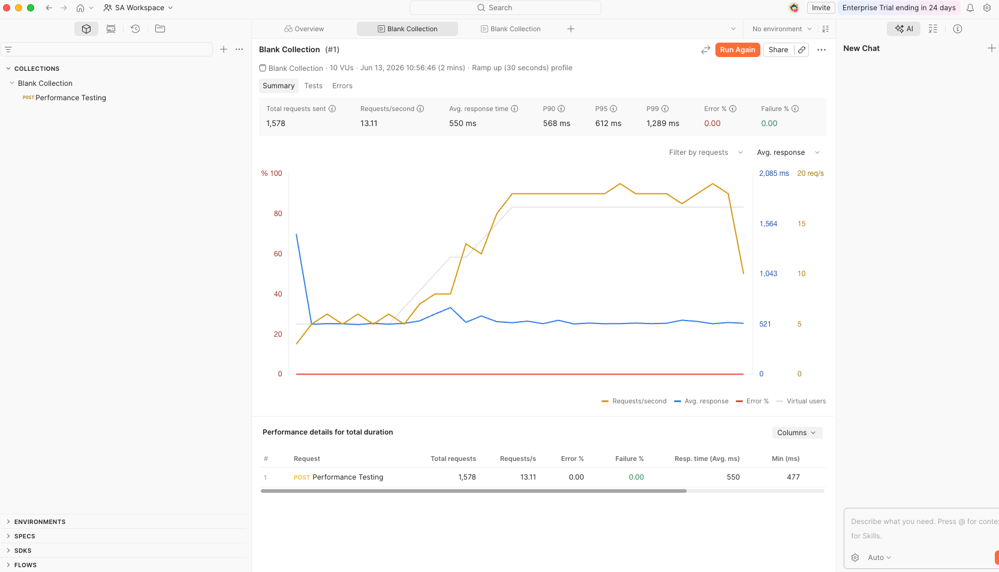
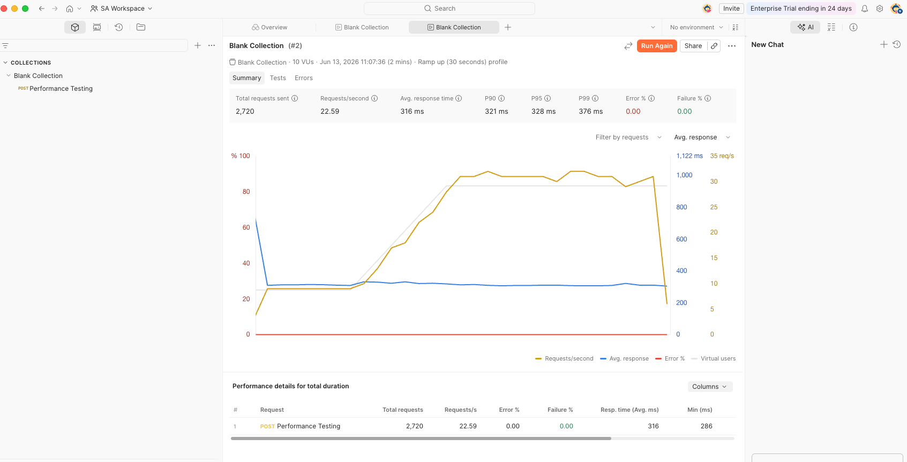
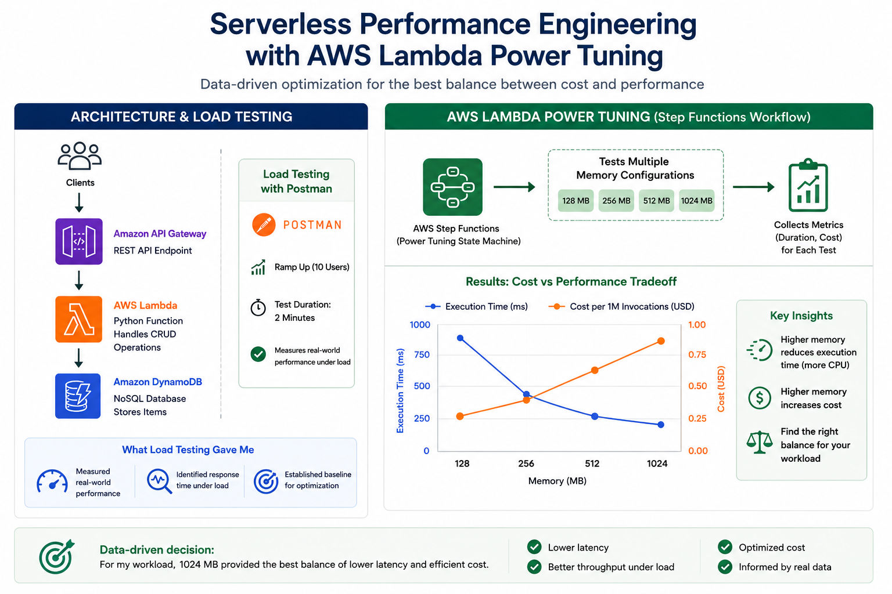
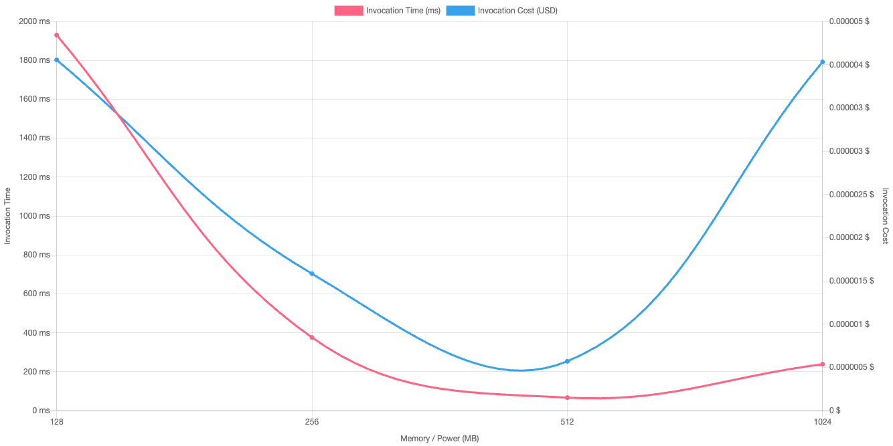

# AWS Serverless Performance Optimization Lab

## Overview

This project demonstrates how to build, test, and optimize a serverless microservice using AWS services.

### Technologies Used

* Amazon API Gateway
* AWS Lambda
* Amazon DynamoDB
* AWS Step Functions
* AWS Lambda Power Tuning
* Postman Performance Testing

The objective was to build a serverless API, test it under load, analyze performance bottlenecks, and identify the optimal Lambda memory configuration using a data-driven approach.

---

## Architecture

### Request Flow

Client → API Gateway → Lambda → DynamoDB

The Lambda function performs CRUD operations against DynamoDB through a REST API exposed by API Gateway.

### Serverless Benefits

* No servers to provision or manage
* Automatic scaling
* Pay-per-use pricing model
* Event-driven architecture
* High availability through managed AWS services

---

## Load Testing and Performance Optimization

To establish a performance baseline, the Lambda function was initially configured with **128 MB** of memory.

Performance testing was performed using Postman Runner with:

* 10 Virtual Users
* 2 Minute Duration
* Ramp Up (30 Seconds) Profile

---

### Baseline Test (128 MB Memory)

#### Results

| Metric                | Value    |
| --------------------- | -------- |
| Total Requests        | 1,578    |
| Requests / Second     | 13.11    |
| Average Response Time | 550 ms   |
| P90 Response Time     | 568 ms   |
| P95 Response Time     | 612 ms   |
| P99 Response Time     | 1,289 ms |
| Error Rate            | 0%       |

The baseline test established application performance before optimization.

---

### Optimization Performed

The Lambda memory allocation was increased from **128 MB** to **1024 MB**.

AWS Lambda allocates additional CPU resources as memory increases. This can significantly improve performance for workloads that are CPU-bound or process-intensive.

---

### Optimized Test (1024 MB Memory)

#### Results

| Metric                | Value  |
| --------------------- | ------ |
| Total Requests        | 2,720  |
| Requests / Second     | 22.59  |
| Average Response Time | 316 ms |
| P90 Response Time     | 321 ms |
| P95 Response Time     | 328 ms |
| P99 Response Time     | 376 ms |
| Error Rate            | 0%     |

---

### Performance Comparison

| Metric                |   128 MB | 1024 MB | Improvement |
| --------------------- | -------: | ------: | ----------: |
| Total Requests        |    1,578 |   2,720 |        +72% |
| Requests / Second     |    13.11 |   22.59 |        +72% |
| Average Response Time |   550 ms |  316 ms |  43% Faster |
| P90 Response Time     |   568 ms |  321 ms |  43% Faster |
| P95 Response Time     |   612 ms |  328 ms |  46% Faster |
| P99 Response Time     | 1,289 ms |  376 ms |  71% Faster |

### Key Findings

The optimized Lambda configuration processed significantly more requests while reducing response times across all latency percentiles.

Key improvements observed:

* 72% increase in throughput
* 72% increase in total requests processed
* 43% reduction in average response time
* 71% improvement in P99 latency
* Zero errors during testing

This exercise demonstrated that Lambda memory allocation can have a substantial impact on application performance because AWS automatically provides additional CPU resources as memory increases.

---

## AWS Lambda Power Tuning

AWS Lambda Power Tuning was used to evaluate multiple memory configurations and visualize the tradeoff between performance and cost.

### Memory Configurations Evaluated

* 128 MB
* 256 MB
* 512 MB
* 1024 MB

The goal was to identify the most effective configuration for this workload based on performance characteristics and resource utilization.

---

### Power Tuning Results

AWS Lambda Power Tuning evaluates:

* Execution duration
* Cost per invocation
* Cost vs performance tradeoffs
* Balanced optimization strategies

Using actual performance data helps architects make informed decisions rather than relying on default configurations.

---

## AWS Well-Architected Framework

This exercise aligns with several AWS Well-Architected Framework pillars.

### Performance Efficiency

Lambda Power Tuning helps identify the most efficient memory allocation for a workload.

Increasing memory from 128 MB to 1024 MB resulted in significantly improved throughput and lower response times.

### Cost Optimization

Power Tuning helps visualize cost versus performance tradeoffs, enabling data-driven resource allocation decisions.

### Operational Excellence

Load testing provides measurable performance data and helps validate architectural decisions before production deployment.

### Reliability

Performance testing validates application behavior under load and helps identify potential bottlenecks before they impact users.

---

## Lessons Learned

One of the biggest takeaways from this project was that serverless applications still require performance engineering.

Rather than relying on default settings, load testing and Lambda Power Tuning provide measurable data that supports better architectural decisions.

Using a data-driven approach resulted in:

* 72% higher throughput
* 43% lower average response times
* 71% improvement in P99 latency
* Better understanding of cost vs performance tradeoffs
* Greater confidence in architectural decisions

This project reinforced the importance of measuring, testing, and optimizing cloud workloads before moving them into production.

---

## Future Enhancements

Potential next steps for this project include:

* Integrating Amazon CloudWatch dashboards
* Adding AWS X-Ray tracing
* Implementing CI/CD with GitHub Actions
* Expanding load testing scenarios
* Performing detailed cost analysis using AWS Pricing Calculator
